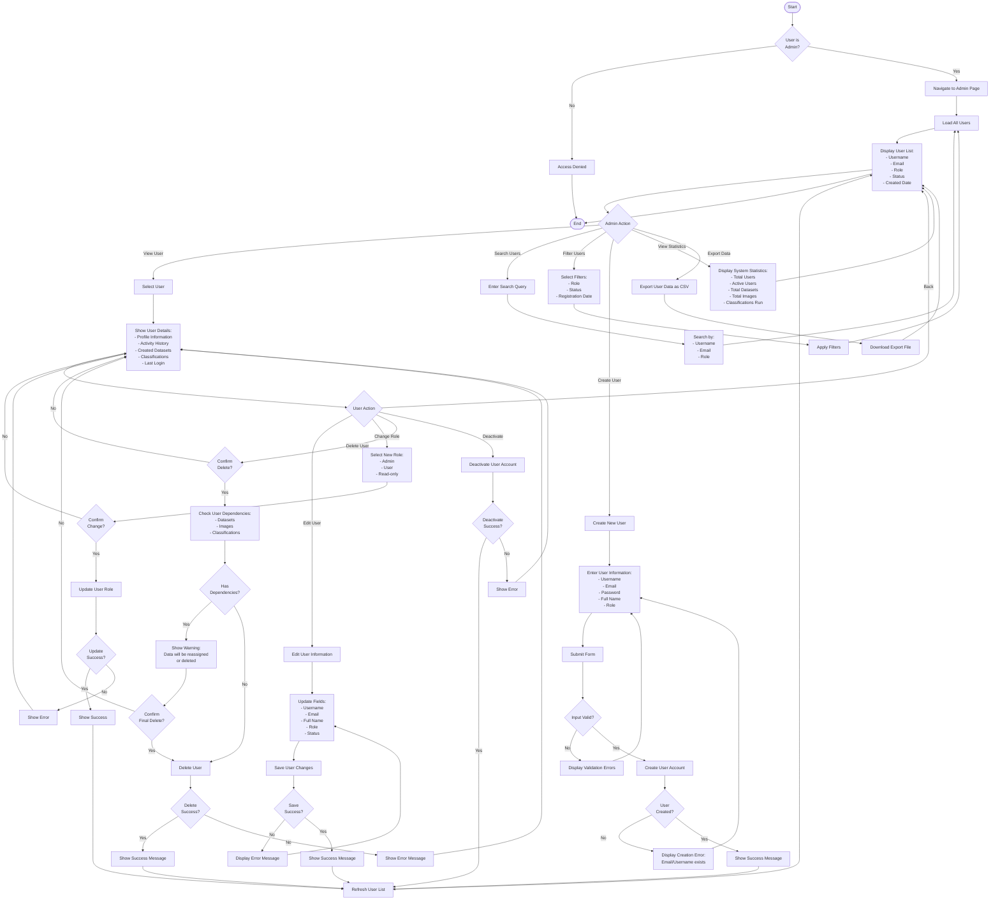
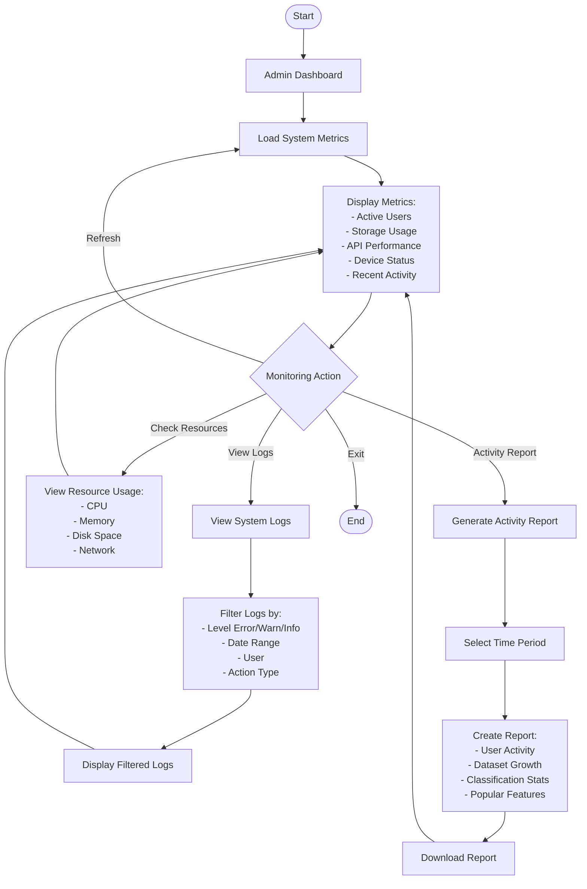

# Admin Operations Activity Diagram

## User Management (Admin)

```mermaid
graph TD
    Start([Start]) --> CheckAdmin{User is<br/>Admin?}
    CheckAdmin -->|No| AccessDenied[Access Denied]
    AccessDenied --> End([End])
    
    CheckAdmin -->|Yes| AdminPage[Navigate to Admin Page]
    AdminPage --> LoadUsers[Load All Users]
    LoadUsers --> DisplayUsers[Display User List:<br/>- Username<br/>- Email<br/>- Role<br/>- Status<br/>- Created Date]
    
    DisplayUsers --> AdminAction{Admin Action}
    
    AdminAction -->|View User| SelectUser[Select User]
    SelectUser --> ShowUserDetails[Show User Details:<br/>- Profile Information<br/>- Activity History<br/>- Created Datasets<br/>- Classifications<br/>- Last Login]
    
    ShowUserDetails --> UserAction{User Action}
    
    UserAction -->|Edit User| EditUser[Edit User Information]
    EditUser --> UpdateFields[Update Fields:<br/>- Username<br/>- Email<br/>- Full Name<br/>- Role<br/>- Status]
    
    UpdateFields --> SaveChanges[Save User Changes]
    SaveChanges --> SaveSuccess{Save<br/>Success?}
    
    SaveSuccess -->|No| ShowSaveError[Display Error Message]
    ShowSaveError --> UpdateFields
    
    SaveSuccess -->|Yes| ShowSaveSuccess[Show Success Message]
    ShowSaveSuccess --> RefreshUsers[Refresh User List]
    RefreshUsers --> DisplayUsers
    
    UserAction -->|Change Role| SelectRole[Select New Role:<br/>- Admin<br/>- User<br/>- Read-only]
    SelectRole --> ConfirmRoleChange{Confirm<br/>Change?}
    
    ConfirmRoleChange -->|No| ShowUserDetails
    ConfirmRoleChange -->|Yes| UpdateRole[Update User Role]
    UpdateRole --> RoleUpdated{Update<br/>Success?}
    RoleUpdated -->|Yes| ShowRoleSuccess[Show Success]
    RoleUpdated -->|No| ShowRoleError[Show Error]
    ShowRoleSuccess --> RefreshUsers
    ShowRoleError --> ShowUserDetails
    
    UserAction -->|Delete User| ConfirmDelete{Confirm<br/>Delete?}
    ConfirmDelete -->|No| ShowUserDetails
    
    ConfirmDelete -->|Yes| CheckDependencies[Check User Dependencies:<br/>- Datasets<br/>- Images<br/>- Classifications]
    
    CheckDependencies --> HasDependencies{Has<br/>Dependencies?}
    
    HasDependencies -->|Yes| ShowWarning[Show Warning:<br/>Data will be reassigned<br/>or deleted]
    ShowWarning --> ConfirmFinal{Confirm<br/>Final Delete?}
    ConfirmFinal -->|No| ShowUserDetails
    ConfirmFinal -->|Yes| DeleteUser
    
    HasDependencies -->|No| DeleteUser[Delete User]
    DeleteUser --> DeleteSuccess{Delete<br/>Success?}
    
    DeleteSuccess -->|Yes| ShowDeleteSuccess[Show Success Message]
    ShowDeleteSuccess --> RefreshUsers
    
    DeleteSuccess -->|No| ShowDeleteError[Show Error Message]
    ShowDeleteError --> ShowUserDetails
    
    UserAction -->|Deactivate| DeactivateUser[Deactivate User Account]
    DeactivateUser --> DeactivateSuccess{Deactivate<br/>Success?}
    DeactivateSuccess -->|Yes| RefreshUsers
    DeactivateSuccess -->|No| ShowDeactivateError[Show Error]
    ShowDeactivateError --> ShowUserDetails
    
    UserAction -->|Back| DisplayUsers
    
    AdminAction -->|Search Users| EnterSearch[Enter Search Query]
    EnterSearch --> SearchUsers[Search by:<br/>- Username<br/>- Email<br/>- Role]
    SearchUsers --> LoadUsers
    
    AdminAction -->|Filter Users| SelectFilter[Select Filters:<br/>- Role<br/>- Status<br/>- Registration Date]
    SelectFilter --> ApplyFilter[Apply Filters]
    ApplyFilter --> LoadUsers
    
    AdminAction -->|Create User| CreateNewUser[Create New User]
    CreateNewUser --> EnterNewUserInfo[Enter User Information:<br/>- Username<br/>- Email<br/>- Password<br/>- Full Name<br/>- Role]
    
    EnterNewUserInfo --> SubmitNewUser[Submit Form]
    SubmitNewUser --> ValidateNewUser{Input Valid?}
    
    ValidateNewUser -->|No| ShowValidationError[Display Validation Errors]
    ShowValidationError --> EnterNewUserInfo
    
    ValidateNewUser -->|Yes| CreateUserAccount[Create User Account]
    CreateUserAccount --> CreateSuccess{User<br/>Created?}
    
    CreateSuccess -->|No| ShowCreateError[Display Creation Error:<br/>Email/Username exists]
    ShowCreateError --> EnterNewUserInfo
    
    CreateSuccess -->|Yes| ShowCreateSuccess[Show Success Message]
    ShowCreateSuccess --> RefreshUsers
    
    AdminAction -->|View Statistics| ShowStats[Display System Statistics:<br/>- Total Users<br/>- Active Users<br/>- Total Datasets<br/>- Total Images<br/>- Classifications Run]
    ShowStats --> DisplayUsers
    
    AdminAction -->|Export Data| ExportUsers[Export User Data as CSV]
    ExportUsers --> DownloadFile[Download Export File]
    DownloadFile --> DisplayUsers
    
    DisplayUsers --> End
```

## System Monitoring

```mermaid
graph TD
    Start([Start]) --> AdminDash[Admin Dashboard]
    AdminDash --> LoadMetrics[Load System Metrics]
    
    LoadMetrics --> DisplayMetrics[Display Metrics:<br/>- Active Users<br/>- Storage Usage<br/>- API Performance<br/>- Device Status<br/>- Recent Activity]
    
    DisplayMetrics --> MonitorChoice{Monitoring Action}
    
    MonitorChoice -->|View Logs| ViewLogs[View System Logs]
    ViewLogs --> FilterLogs[Filter Logs by:<br/>- Level Error/Warn/Info<br/>- Date Range<br/>- User<br/>- Action Type]
    FilterLogs --> DisplayLogs[Display Filtered Logs]
    DisplayLogs --> DisplayMetrics
    
    MonitorChoice -->|Check Resources| ViewResources[View Resource Usage:<br/>- CPU<br/>- Memory<br/>- Disk Space<br/>- Network]
    ViewResources --> DisplayMetrics
    
    MonitorChoice -->|Activity Report| GenerateReport[Generate Activity Report]
    GenerateReport --> SelectPeriod[Select Time Period]
    SelectPeriod --> CreateReport[Create Report:<br/>- User Activity<br/>- Dataset Growth<br/>- Classification Stats<br/>- Popular Features]
    CreateReport --> DownloadReport[Download Report]
    DownloadReport --> DisplayMetrics
    
    MonitorChoice -->|Refresh| LoadMetrics
    
    MonitorChoice -->|Exit| End([End])
```
