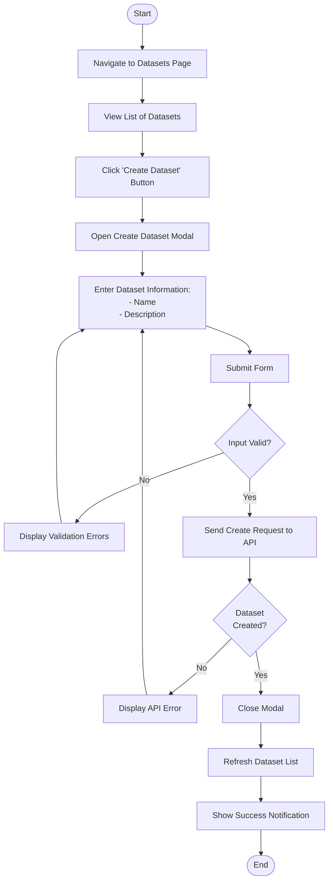
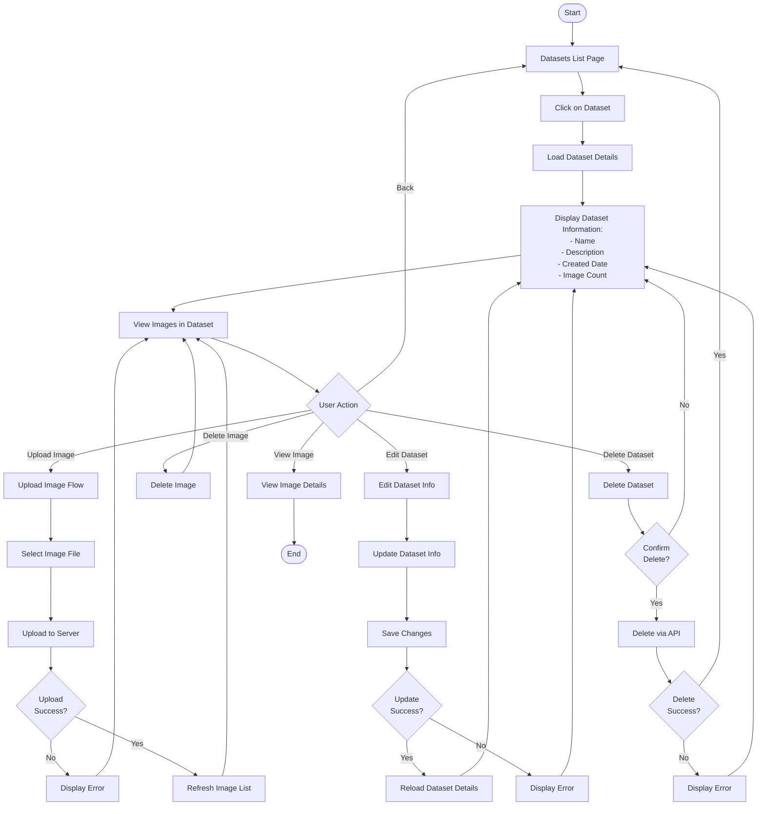

# Dataset Management Activity Diagram

## Create Dataset

```mermaid
graph TD
    Start([Start]) --> DatasetsPage[Navigate to Datasets Page]
    DatasetsPage --> ViewList[View List of Datasets]
    ViewList --> ClickCreate[Click 'Create Dataset' Button]
    
    ClickCreate --> OpenModal[Open Create Dataset Modal]
    OpenModal --> EnterInfo[Enter Dataset Information:<br/>- Name<br/>- Description]
    
    EnterInfo --> SubmitForm[Submit Form]
    SubmitForm --> ValidateInput{Input Valid?}
    
    ValidateInput -->|No| ShowError[Display Validation Errors]
    ShowError --> EnterInfo
    
    ValidateInput -->|Yes| CreateDataset[Send Create Request to API]
    CreateDataset --> DatasetCreated{Dataset<br/>Created?}
    
    DatasetCreated -->|No| ShowAPIError[Display API Error]
    ShowAPIError --> EnterInfo
    
    DatasetCreated -->|Yes| CloseModal[Close Modal]
    CloseModal --> RefreshList[Refresh Dataset List]
    RefreshList --> ShowSuccess[Show Success Notification]
    ShowSuccess --> End([End])
```

## View and Manage Dataset

```mermaid
graph TD
    Start([Start]) --> ListPage[Datasets List Page]
    ListPage --> SelectDataset[Click on Dataset]
    SelectDataset --> LoadDetails[Load Dataset Details]
    
    LoadDetails --> ShowDetails[Display Dataset Information:<br/>- Name<br/>- Description<br/>- Created Date<br/>- Image Count]
    
    ShowDetails --> ViewImages[View Images in Dataset]
    ViewImages --> UserAction{User Action}
    
    UserAction -->|Upload Image| UploadFlow[Upload Image Flow]
    UserAction -->|View Image| ViewImage[View Image Details]
    UserAction -->|Delete Image| DeleteImage[Delete Image]
    UserAction -->|Edit Dataset| EditDataset[Edit Dataset Info]
    UserAction -->|Delete Dataset| DeleteDataset[Delete Dataset]
    UserAction -->|Back| ListPage
    
    UploadFlow --> SelectFile[Select Image File]
    SelectFile --> UploadImage[Upload to Server]
    UploadImage --> UploadSuccess{Upload<br/>Success?}
    
    UploadSuccess -->|No| ShowUploadError[Display Error]
    ShowUploadError --> ViewImages
    
    UploadSuccess -->|Yes| RefreshImages[Refresh Image List]
    RefreshImages --> ViewImages
    
    EditDataset --> UpdateInfo[Update Dataset Info]
    UpdateInfo --> SaveChanges[Save Changes]
    SaveChanges --> UpdateSuccess{Update<br/>Success?}
    
    UpdateSuccess -->|Yes| ReloadDetails[Reload Dataset Details]
    UpdateSuccess -->|No| ShowEditError[Display Error]
    ShowEditError --> ShowDetails
    ReloadDetails --> ShowDetails
    
    DeleteDataset --> ConfirmDelete{Confirm<br/>Delete?}
    ConfirmDelete -->|No| ShowDetails
    ConfirmDelete -->|Yes| DeleteAPI[Delete via API]
    DeleteAPI --> DeleteSuccess{Delete<br/>Success?}
    
    DeleteSuccess -->|Yes| ListPage
    DeleteSuccess -->|No| ShowDeleteError[Display Error]
    ShowDeleteError --> ShowDetails
    
    ViewImage --> End([End])
    DeleteImage --> ViewImages
```
