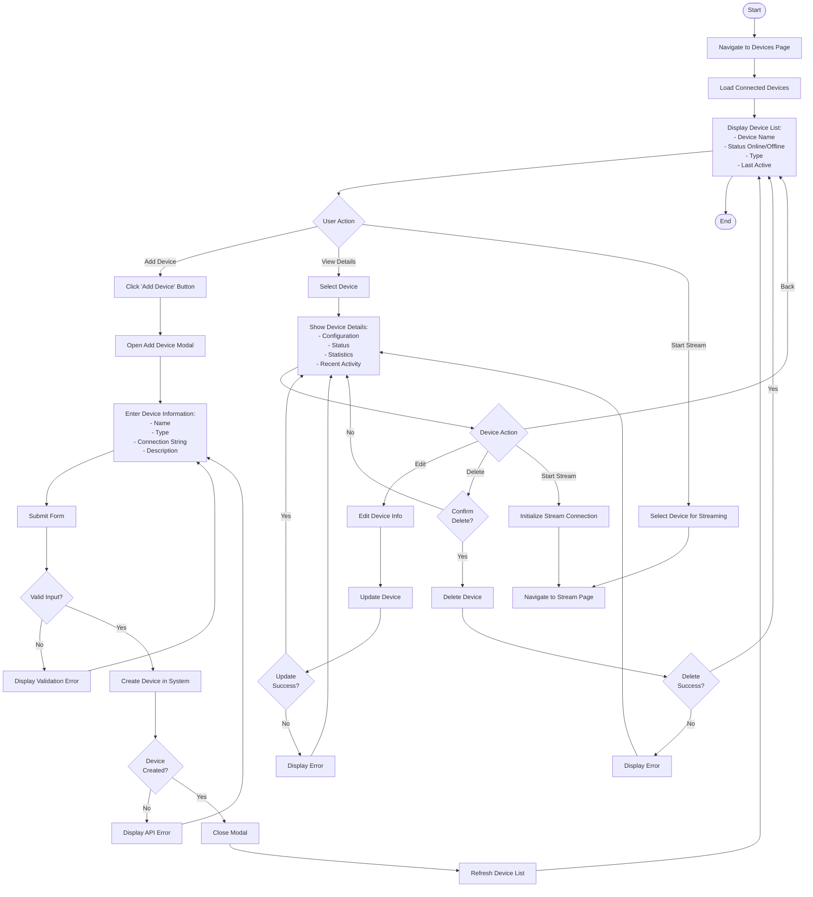
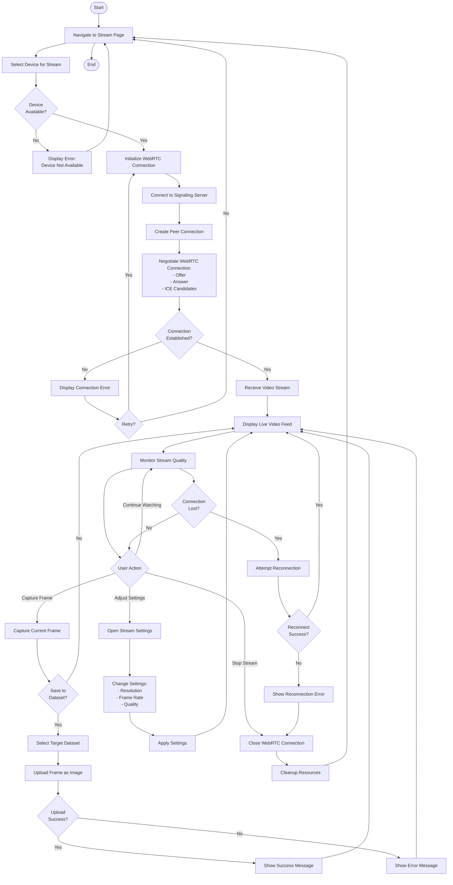

# Device and Streaming Activity Diagram

## Device Management

```mermaid
graph TD
    Start([Start]) --> DevicesPage[Navigate to Devices Page]
    DevicesPage --> LoadDevices[Load Connected Devices]
    LoadDevices --> DisplayList[Display Device List:<br/>- Device Name<br/>- Status Online/Offline<br/>- Type<br/>- Last Active]
    
    DisplayList --> UserChoice{User Action}
    
    UserChoice -->|Add Device| ClickAdd[Click 'Add Device' Button]
    ClickAdd --> OpenAddModal[Open Add Device Modal]
    OpenAddModal --> EnterDeviceInfo[Enter Device Information:<br/>- Name<br/>- Type<br/>- Connection String<br/>- Description]
    
    EnterDeviceInfo --> SubmitDevice[Submit Form]
    SubmitDevice --> ValidateDevice{Valid Input?}
    
    ValidateDevice -->|No| ShowDeviceError[Display Validation Error]
    ShowDeviceError --> EnterDeviceInfo
    
    ValidateDevice -->|Yes| CreateDevice[Create Device in System]
    CreateDevice --> DeviceCreated{Device<br/>Created?}
    
    DeviceCreated -->|No| ShowAPIError[Display API Error]
    ShowAPIError --> EnterDeviceInfo
    
    DeviceCreated -->|Yes| CloseAddModal[Close Modal]
    CloseAddModal --> RefreshDevices[Refresh Device List]
    RefreshDevices --> DisplayList
    
    UserChoice -->|View Details| SelectDevice[Select Device]
    SelectDevice --> ShowDeviceDetails[Show Device Details:<br/>- Configuration<br/>- Status<br/>- Statistics<br/>- Recent Activity]
    
    ShowDeviceDetails --> DeviceAction{Device Action}
    
    DeviceAction -->|Edit| EditDevice[Edit Device Info]
    EditDevice --> UpdateDevice[Update Device]
    UpdateDevice --> UpdateSuccess{Update<br/>Success?}
    UpdateSuccess -->|Yes| ShowDeviceDetails
    UpdateSuccess -->|No| ShowUpdateError[Display Error]
    ShowUpdateError --> ShowDeviceDetails
    
    DeviceAction -->|Delete| ConfirmDeleteDev{Confirm<br/>Delete?}
    ConfirmDeleteDev -->|No| ShowDeviceDetails
    ConfirmDeleteDev -->|Yes| DeleteDevice[Delete Device]
    DeleteDevice --> DeleteDevSuccess{Delete<br/>Success?}
    DeleteDevSuccess -->|Yes| DisplayList
    DeleteDevSuccess -->|No| ShowDelError[Display Error]
    ShowDelError --> ShowDeviceDetails
    
    DeviceAction -->|Start Stream| StartStream[Initialize Stream Connection]
    StartStream --> StreamPage
    
    DeviceAction -->|Back| DisplayList
    
    UserChoice -->|Start Stream| SelectStreamDevice[Select Device for Streaming]
    SelectStreamDevice --> StreamPage[Navigate to Stream Page]
    
    DisplayList --> End([End])
```

## Live Streaming

```mermaid
graph TD
    Start([Start]) --> StreamPage[Navigate to Stream Page]
    StreamPage --> SelectDevice[Select Device for Stream]
    
    SelectDevice --> CheckDevice{Device<br/>Available?}
    
    CheckDevice -->|No| ShowDeviceError[Display Error:<br/>Device Not Available]
    ShowDeviceError --> StreamPage
    
    CheckDevice -->|Yes| InitWebRTC[Initialize WebRTC Connection]
    InitWebRTC --> ConnectSignaling[Connect to Signaling Server]
    
    ConnectSignaling --> CreatePeerConn[Create Peer Connection]
    CreatePeerConn --> NegotiateConn[Negotiate WebRTC Connection:<br/>- Offer<br/>- Answer<br/>- ICE Candidates]
    
    NegotiateConn --> ConnectionStatus{Connection<br/>Established?}
    
    ConnectionStatus -->|No| ShowConnError[Display Connection Error]
    ShowConnError --> RetryConn{Retry?}
    RetryConn -->|Yes| InitWebRTC
    RetryConn -->|No| StreamPage
    
    ConnectionStatus -->|Yes| ReceiveStream[Receive Video Stream]
    ReceiveStream --> DisplayVideo[Display Live Video Feed]
    
    DisplayVideo --> MonitorStream[Monitor Stream Quality]
    MonitorStream --> StreamAction{User Action}
    
    StreamAction -->|Capture Frame| CaptureImage[Capture Current Frame]
    CaptureImage --> SaveToDataset{Save to<br/>Dataset?}
    
    SaveToDataset -->|Yes| SelectDataset[Select Target Dataset]
    SelectDataset --> UploadFrame[Upload Frame as Image]
    UploadFrame --> UploadSuccess{Upload<br/>Success?}
    UploadSuccess -->|Yes| ShowCaptureSuccess[Show Success Message]
    UploadSuccess -->|No| ShowCaptureError[Show Error Message]
    ShowCaptureSuccess --> DisplayVideo
    ShowCaptureError --> DisplayVideo
    
    SaveToDataset -->|No| DisplayVideo
    
    StreamAction -->|Adjust Settings| OpenSettings[Open Stream Settings]
    OpenSettings --> ChangeSettings[Change Settings:<br/>- Resolution<br/>- Frame Rate<br/>- Quality]
    ChangeSettings --> ApplySettings[Apply Settings]
    ApplySettings --> DisplayVideo
    
    StreamAction -->|Stop Stream| CloseConnection[Close WebRTC Connection]
    CloseConnection --> Cleanup[Cleanup Resources]
    Cleanup --> StreamPage
    
    StreamAction -->|Continue Watching| MonitorStream
    
    MonitorStream --> CheckConnection{Connection<br/>Lost?}
    CheckConnection -->|Yes| AttemptReconnect[Attempt Reconnection]
    AttemptReconnect --> ReconnectSuccess{Reconnect<br/>Success?}
    ReconnectSuccess -->|Yes| DisplayVideo
    ReconnectSuccess -->|No| ShowReconnectError[Show Reconnection Error]
    ShowReconnectError --> CloseConnection
    
    CheckConnection -->|No| StreamAction
    
    StreamPage --> End([End])
```
