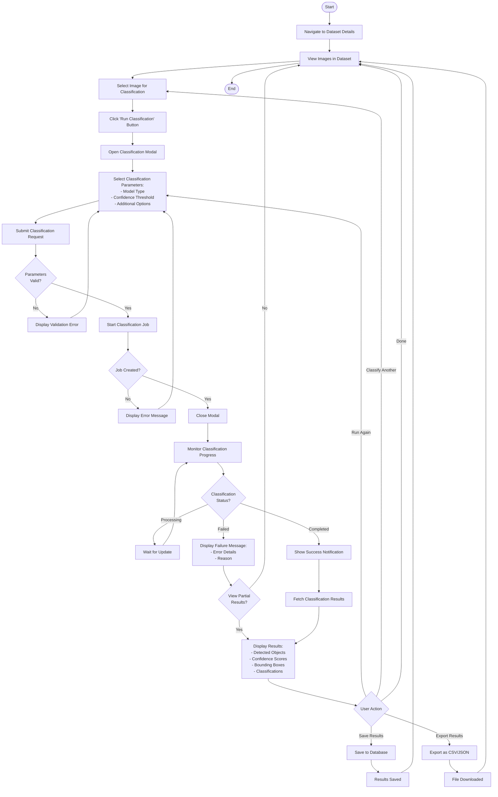
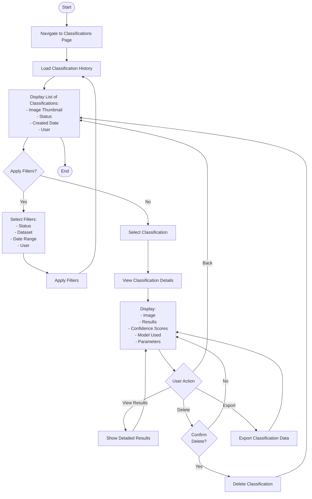

# Image Classification Activity Diagram

## Run AI Classification

```mermaid
graph TD
    Start([Start]) --> DatasetPage[Navigate to Dataset Details]
    DatasetPage --> ViewImages[View Images in Dataset]
    ViewImages --> SelectImage[Select Image for Classification]
    
    SelectImage --> ClickClassify[Click 'Run Classification' Button]
    ClickClassify --> OpenClassifyModal[Open Classification Modal]
    
    OpenClassifyModal --> SelectParams[Select Classification Parameters:<br/>- Model Type<br/>- Confidence Threshold<br/>- Additional Options]
    
    SelectParams --> SubmitClassify[Submit Classification Request]
    SubmitClassify --> ValidateParams{Parameters<br/>Valid?}
    
    ValidateParams -->|No| ShowValidationError[Display Validation Error]
    ShowValidationError --> SelectParams
    
    ValidateParams -->|Yes| StartClassification[Start Classification Job]
    StartClassification --> JobCreated{Job Created?}
    
    JobCreated -->|No| ShowError[Display Error Message]
    ShowError --> SelectParams
    
    JobCreated -->|Yes| CloseModal[Close Modal]
    CloseModal --> MonitorProgress[Monitor Classification Progress]
    
    MonitorProgress --> CheckStatus{Classification<br/>Status?}
    
    CheckStatus -->|Processing| WaitStatus[Wait for Update]
    WaitStatus --> MonitorProgress
    
    CheckStatus -->|Failed| ShowFailure[Display Failure Message:<br/>- Error Details<br/>- Reason]
    ShowFailure --> ViewResults{View Partial<br/>Results?}
    ViewResults -->|Yes| DisplayResults
    ViewResults -->|No| ViewImages
    
    CheckStatus -->|Completed| ShowSuccess[Show Success Notification]
    ShowSuccess --> FetchResults[Fetch Classification Results]
    FetchResults --> DisplayResults[Display Results:<br/>- Detected Objects<br/>- Confidence Scores<br/>- Bounding Boxes<br/>- Classifications]
    
    DisplayResults --> UserAction{User Action}
    
    UserAction -->|Save Results| SaveResults[Save to Database]
    SaveResults --> Saved[Results Saved]
    
    UserAction -->|Export Results| ExportResults[Export as CSV/JSON]
    ExportResults --> Downloaded[File Downloaded]
    
    UserAction -->|Run Again| SelectParams
    UserAction -->|Classify Another| SelectImage
    UserAction -->|Done| ViewImages
    
    Saved --> ViewImages
    Downloaded --> ViewImages
    ViewImages --> End([End])
```

## View Classification History

```mermaid
graph TD
    Start([Start]) --> ClassPage[Navigate to Classifications Page]
    ClassPage --> LoadHistory[Load Classification History]
    
    LoadHistory --> DisplayList[Display List of Classifications:<br/>- Image Thumbnail<br/>- Status<br/>- Created Date<br/>- User]
    
    DisplayList --> FilterOptions{Apply Filters?}
    
    FilterOptions -->|Yes| SelectFilters[Select Filters:<br/>- Status<br/>- Dataset<br/>- Date Range<br/>- User]
    SelectFilters --> ApplyFilters[Apply Filters]
    ApplyFilters --> LoadHistory
    
    FilterOptions -->|No| SelectClass[Select Classification]
    
    SelectClass --> ViewDetails[View Classification Details]
    ViewDetails --> DisplayClassDetails[Display:<br/>- Image<br/>- Results<br/>- Confidence Scores<br/>- Model Used<br/>- Parameters]
    
    DisplayClassDetails --> ActionChoice{User Action}
    
    ActionChoice -->|View Results| ShowResultsDetail[Show Detailed Results]
    ShowResultsDetail --> DisplayClassDetails
    
    ActionChoice -->|Delete| ConfirmDelete{Confirm<br/>Delete?}
    ConfirmDelete -->|Yes| DeleteClass[Delete Classification]
    DeleteClass --> DisplayList
    ConfirmDelete -->|No| DisplayClassDetails
    
    ActionChoice -->|Back| DisplayList
    ActionChoice -->|Export| ExportData[Export Classification Data]
    ExportData --> DisplayClassDetails
    
    DisplayList --> End([End])
```
