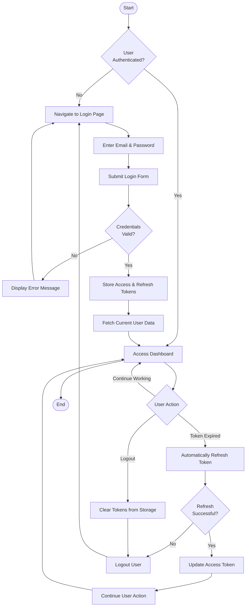
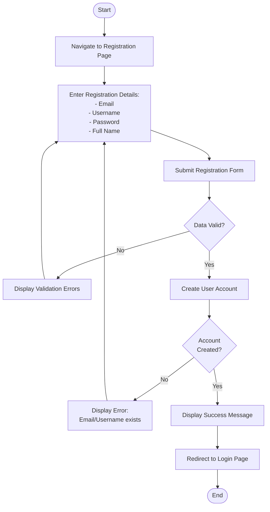

# User Authentication Activity Diagram

```mermaid
graph TD
    Start([Start]) --> CheckAuth{User<br/>Authenticated?}
    CheckAuth -->|No| Login[Navigate to Login Page]
    CheckAuth -->|Yes| Dashboard[Access Dashboard]
    
    Login --> EnterCreds[Enter Email & Password]
    EnterCreds --> SubmitLogin[Submit Login Form]
    SubmitLogin --> ValidateCreds{Credentials<br/>Valid?}
    
    ValidateCreds -->|No| ShowError[Display Error Message]
    ShowError --> Login
    
    ValidateCreds -->|Yes| StoreTokens[Store Access & Refresh Tokens]
    StoreTokens --> FetchUser[Fetch Current User Data]
    FetchUser --> Dashboard
    
    Dashboard --> UserAction{User Action}
    
    UserAction -->|Token Expired| RefreshToken[Automatically Refresh Token]
    RefreshToken --> TokenValid{Refresh<br/>Successful?}
    TokenValid -->|Yes| UpdateToken[Update Access Token]
    UpdateToken --> ContinueAction[Continue User Action]
    TokenValid -->|No| Logout[Logout User]
    
    UserAction -->|Logout| ClearTokens[Clear Tokens from Storage]
    ClearTokens --> Logout
    Logout --> Login
    
    UserAction -->|Continue Working| Dashboard
    
    ContinueAction --> Dashboard
    
    Dashboard --> End([End])
```

## Registration Flow

```mermaid
graph TD
    Start([Start]) --> RegPage[Navigate to Registration Page]
    RegPage --> EnterDetails[Enter Registration Details:<br/>- Email<br/>- Username<br/>- Password<br/>- Full Name]
    
    EnterDetails --> SubmitReg[Submit Registration Form]
    SubmitReg --> ValidateData{Data Valid?}
    
    ValidateData -->|No| ShowErrors[Display Validation Errors]
    ShowErrors --> EnterDetails
    
    ValidateData -->|Yes| CreateAccount[Create User Account]
    CreateAccount --> AccountCreated{Account<br/>Created?}
    
    AccountCreated -->|No| ShowRegError[Display Error:<br/>Email/Username exists]
    ShowRegError --> EnterDetails
    
    AccountCreated -->|Yes| ShowSuccess[Display Success Message]
    ShowSuccess --> RedirectLogin[Redirect to Login Page]
    RedirectLogin --> End([End])
```
